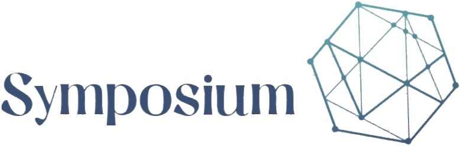

# Symposium: the collaboration place

## Summary
Symposium is an free, real-time, collaborative text editor written in C++ language. Like in the ancient Greece, Symposium allows you to collaborate and exchange ideas with other people in a environment that suits you.

It's developed on purpose for an academic project, but it is intended to remain free for your contribution. Symposium is a client-server software that uses **Conflict-Free Replicated Data Types** (CRDT) to make sure all users stay in-sync.

## Getting Started

To build and run the project make sure you have the necessary components present in your system.

If you want to proceed with [CMakeList file](CMakeLists.txt), there are 2 main targets: one for the server (SymposiumServer) and one for the client (SymposiumGui).

If you want to proceed with .pro file, there are 2 project in the [directory](GUI/SymposiumGui): one for the server ([SymposiumGui_Server.pro](GUI/SymposiumGui/SymposiumGui_Server.pro)) and one for the client ([SymposiumGui.pro](GUI/SymposiumGui/SymposiumGui.pro))

### Prerequisites

You need the following components to be able to install and run the program:
+ boost libraries;
+ Qt libraries (version 5.12.3);
+ C++ environment (c++17);

In particular we use:
+ [Qt Creator](https://www.qt.io/download);
+ [Clion](https://www.jetbrains.com/clion/download/#section=windows);
+ [Mingw Distro compiler for boost serialization](https://nuwen.net/mingw.html)

## Authors

* **Riccardo Zaccone** - [PurpleBooth](https://github.com/PurpleBooth)
* **Ksenia Del Conte Akimova** - [PurpleBooth](https://github.com/PurpleBooth)
* **Cristian Giannetto** - [PurpleBooth](https://github.com/PurpleBooth)
* **Martina Bellissimo** - [PurpleBooth](https://github.com/PurpleBooth)

## License
Symposium is free software: you can redistribute it and/or modify it under the terms of the GNU General Public License as published by the Free Software Foundation, either version 3 of the License, or (at your option) any later version. See the [COPYING](COPYING) file for details.
